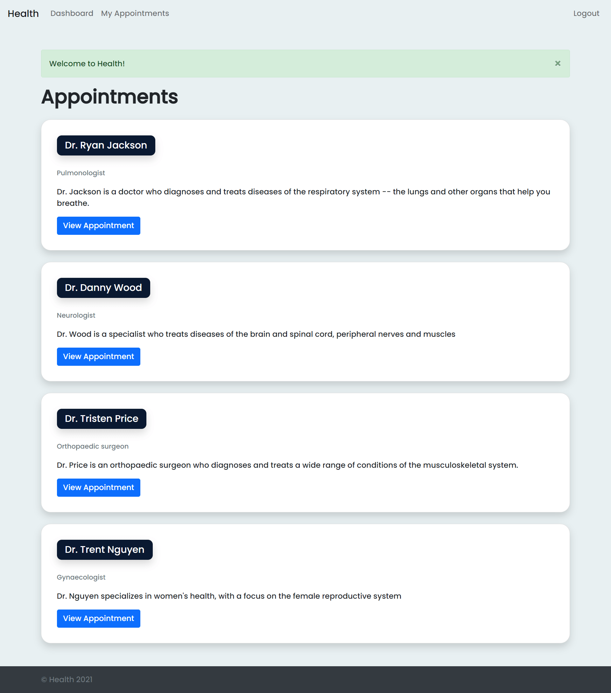
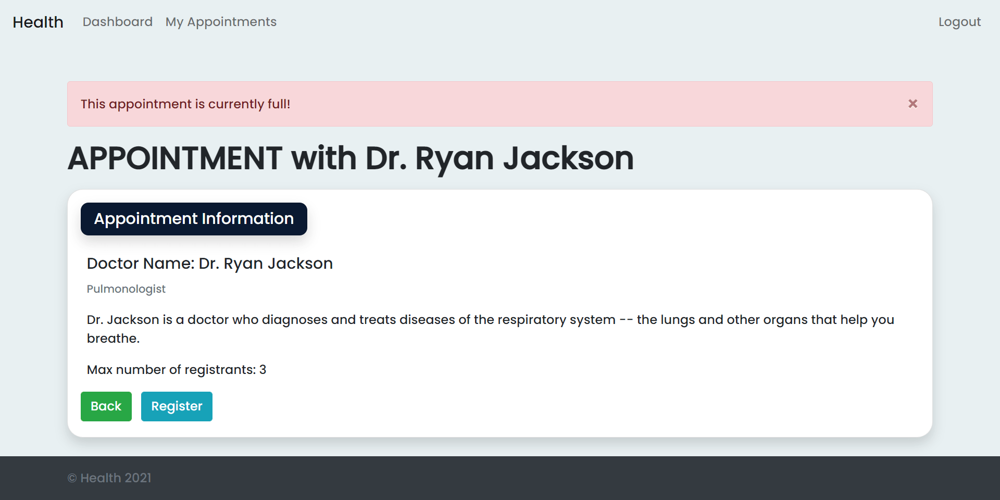
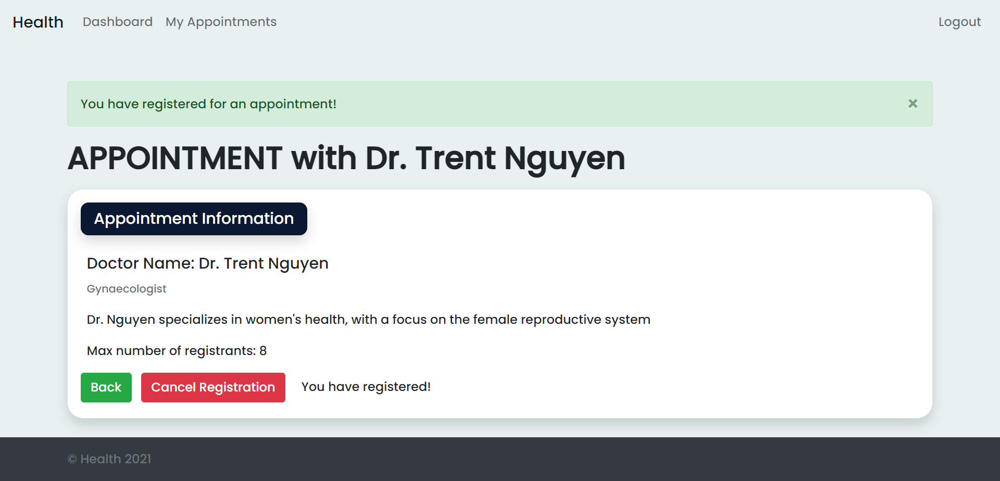
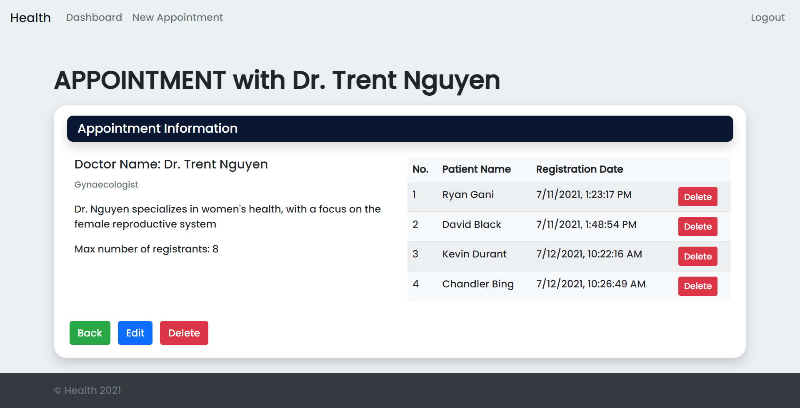
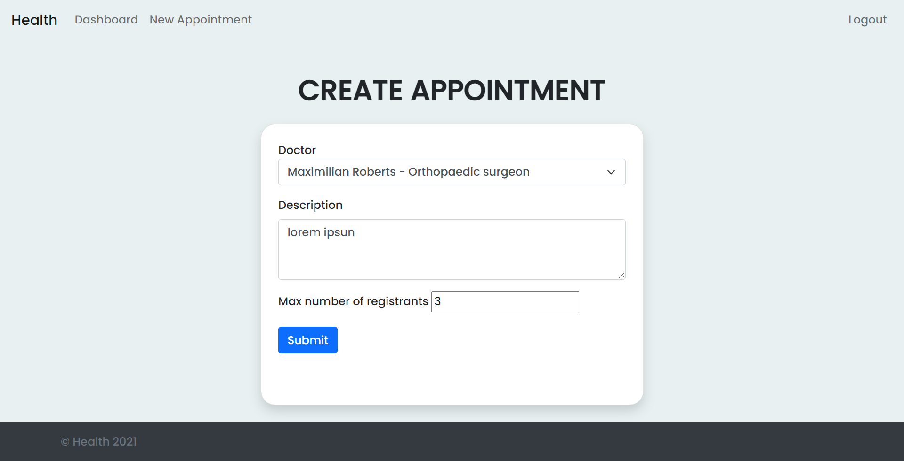
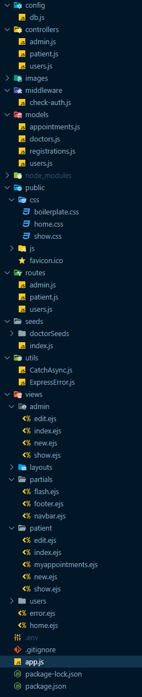
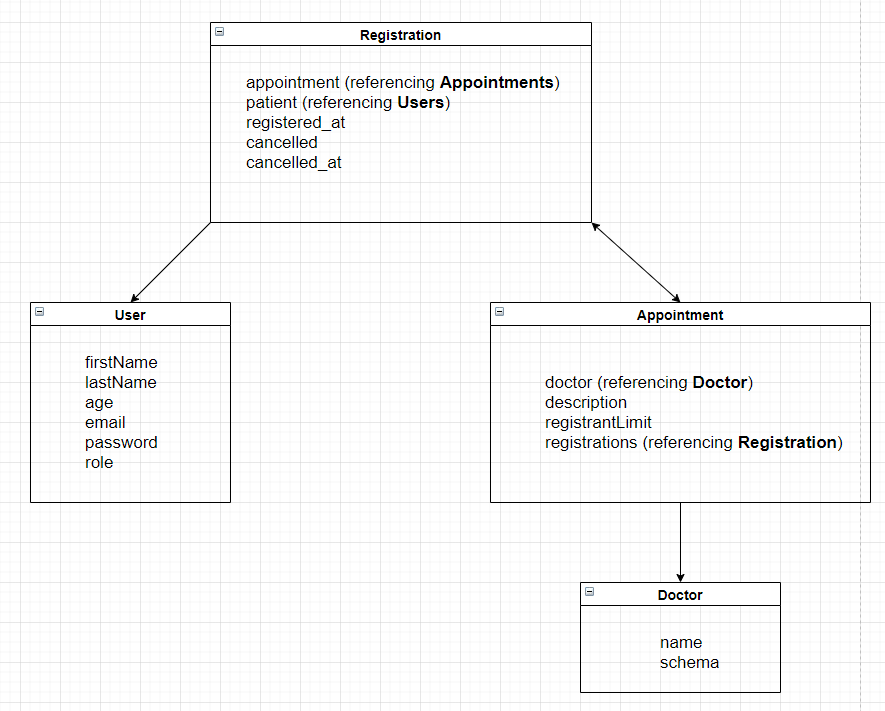

# Health - Hospital Information System

Health is a Hospital Information/Management System for doctors, hospital admins, and patients. 
This personal project is submitted for COMPFEST UI 2021 to join their Software Engineering Academy.

## Screenshots
### Home Page


### Patient View





### Admin View




## Demo

https://warm-bastion-81767.herokuapp.com/

For admin access:
- username: admin
- password: admin

  
## Installation

1. Download repository

```bash
  git clone https://github.com/ryanjgani/Health_v1.git
```
2. Open terminal and change directory to the project folder. And install all the dependencies
```bash
  npm install
```
3. To run this project, you will need to add the following environment variables to your .env file
```bash
  JWT_KEY
  MONGO_KEY
```
**JWT_KEY** stores the secret key for JWT authentication  
**MONGO_KEY** stores the database password to connect to MongoDB Atlas  
You should insert your own MongoDB Atlas URL and store your password in MONGO_KEY  
Or you can use your local MongoDB URL  

```bash
  'mongodb://localhost:27017/<database_name>'
```
4. Start the server from the terminal
```bash
  node app.js
```
4. Type http://localhost:3000/ into a browser


## Code Organization


## Database Schema


  
## How to Use

There are 3 main parts in this application:  
    1. **Authentication**
    - There are two types of account roles: Administrator and Patient  
    - JWT is used for authentication and stored in cookies  
    - You can register as many Patients as you want, however there is only one Admin account  
    2. **Administor Roles**
    - Administrator can create a new doctor appointment  
    - Administrator can update and delete doctor appointments.
    - Administrator can see a list of patients that are registered in each appointment.  
    3. **Patient Roles**  
    - Patients can see a list of appointments.  
    - Patients can apply for an appointment.  
    - Patients can cancel their appointment.  
    - Patients cannot apply for an appointment with a fully booked registrant.  

## Technology
Frontend: EJS, Bootstrap  
Backend: Express JS, Node JS  
Database: MongoDB  


  
## Authors

[@ryanjgani](https://www.github.com/ryanjgani)

  
